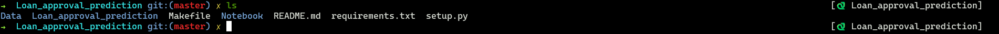
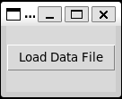
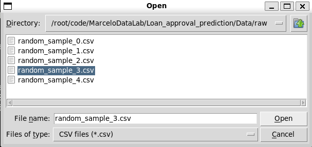
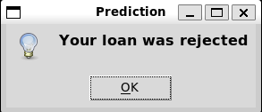

# Loan approval prediction

Loan Approval Prediction is a Python-based tool designed to predict the likelihood of loan approval using various financial parameters.

## Installation

It is recommended to use a Linux terminal (for instance, zsh terminal) to manage your Python environments. To avoid any conflicts with existing libraries, it's best to create a separate pyenv environment for this project.

clone repo from github.

```bash
git clone https://github.com/MarceloDataLab/Loan_approval_prediction.git
```

## Usage


From here, you need to navigate to the 'loan_approval_prediction' directory. Now, execute the following command:

```bash
make lib
```
"make lib" command will install all the libraries necessary for the project to run correctly

Before proceeding, write the following command: 
```bash
make run
```
The make run command will open a new small window:



"Search for the 'Data' folder, open it, navigate to the 'raw' subfolder, and choice and load the any 'test_example.csv' file.



After that, a new window will open with your answer like this:



## Contributing

Pull requests are welcome. For major changes, please open an issue first
to discuss what you would like to change.

Please make sure to update tests as appropriate.

## License

[MIT](https://choosealicense.com/licenses/mit/)
